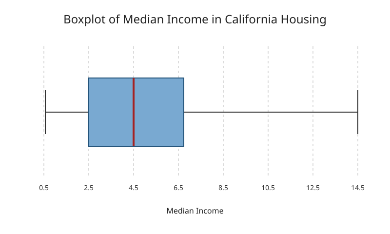

# A01
A project for 2026 Fall semester OPIM 5512 

## Data Used
California Housing dataset

## How to Run the Script

Install the dependencies and run:

```powershell
pip install -r requirements.txt
python src/boxplot.py
```

## Expected output 
A saved boxplot image:


